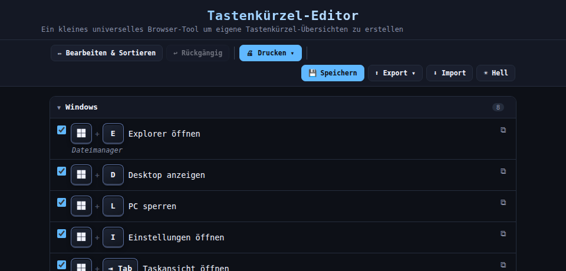
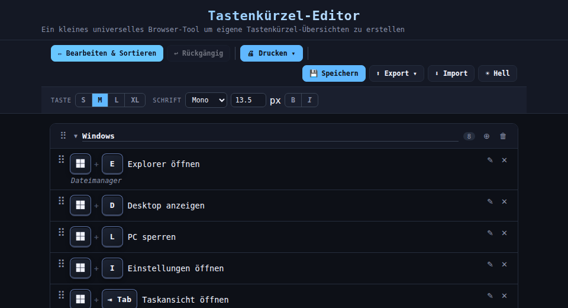
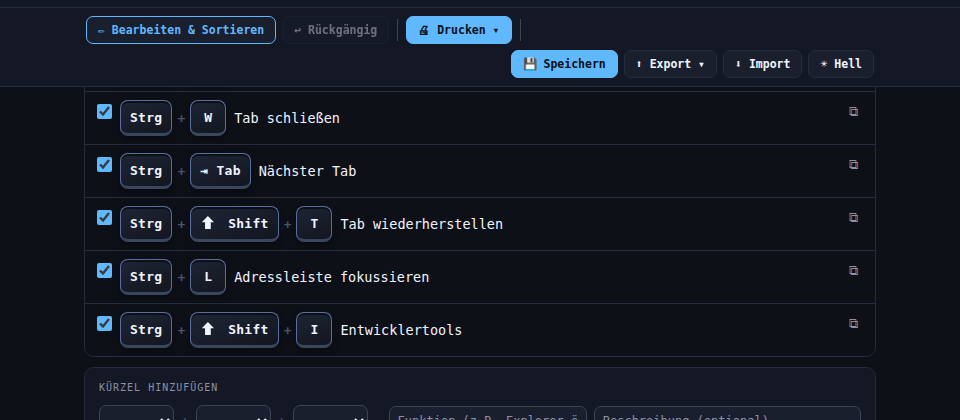
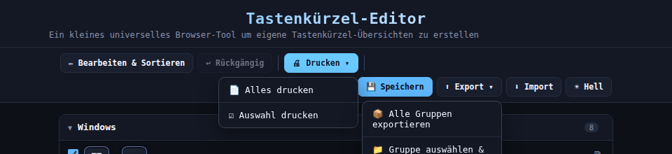
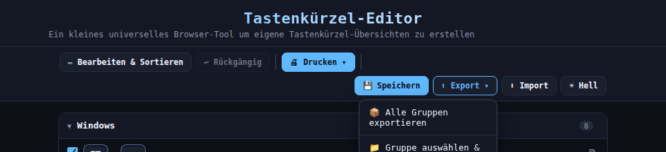
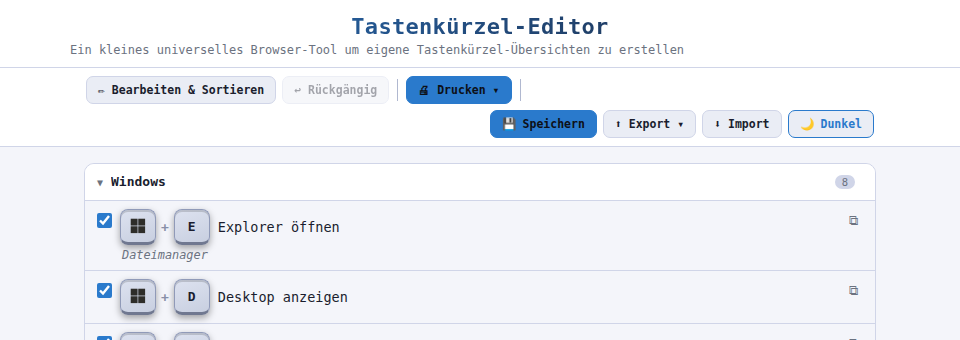

# 📋 Tastenkürzel-Editor

> Browserbasiertes Tool zur Verwaltung eigener Tastenkürzel-Übersichten –
> ohne Installation, ohne Internet, vollständig offline-fähig.

---

## Inhaltsverzeichnis

- [Übersicht](#übersicht)
- [Voraussetzungen](#voraussetzungen)
- [Installation & Start](#installation--start)
- [Normalmodus](#normalmodus)
- [Bearbeitungsmodus](#bearbeitungsmodus)
- [Kürzel hinzufügen](#kürzel-hinzufügen)
- [Erweiterter Modus](#erweiterter-modus)
- [Gruppen & Untergruppen](#gruppen--untergruppen)
- [Drucken & PDF](#drucken--pdf)
- [Speichern](#-speichern)
- [Export / Import](#-export--import)
- [Dark / Light Theme](#dark--light-theme)
- [Tastenkombinationen](#tastenkombinationen-im-tool)
- [Datenspeicherung](#datenspeicherung)
- [Kontakt](#kontakt)

---

## Übersicht

Eine einzige HTML-Datei – kein Server, kein Internet, keine Abhängigkeiten.
Daten werden im Browser gespeichert oder als Datei heruntergeladen.

| Funktion | Beschreibung |
|---|---|
| **Gruppen & Untergruppen** | Tastenkürzel in hierarchische Kategorien einteilen |
| **Drag & Drop** | Einträge UND Gruppen per Ziehen sortieren |
| **Eintrag kopieren** | Felder eines Eintrags ins Formular übernehmen (⧉) |
| **Speichern** | Datei mit eingebetteten Daten herunterladen (geräteübergreifend) |
| **Export / Import** | Gruppen als JSON exportieren und importieren |
| **Auswahl drucken** | Nur ausgewählte Einträge als 3-spaltiges A4-Dokument |
| **Erweiterter Modus** | Individuelle Trennzeichen und Freitext-Tasten |
| **Dark / Light Theme** | Farbschema umschalten, wird gespeichert |
| **Rückgängig** | Bis zu 50 Änderungen rückgängig (`Strg+Z`) |

---

## Voraussetzungen

- Moderner Browser: Chrome 90+, Firefox 88+, Edge 90+, Safari 14+
- Kein Internet erforderlich – vollständig offline nutzbar
- PDF-Export: Druckfunktion des Browsers (`Strg+P`)

> **✓ Empfohlener Browser**
> Google Chrome oder Microsoft Edge für optimalen PDF-Export
> mit korrektem Tastensymbol-Layout.

---

## Installation & Start

1. **Datei herunterladen**
   `tastenkuerzel.html` aus dem Intranet herunterladen oder ZIP entpacken.

2. **Im Browser öffnen**
   Doppelklick auf die Datei oder per Drag & Drop in ein Browser-Fenster ziehen.

3. **Sofort einsatzbereit**
   27 Standard-Tastenkürzel in 5 Gruppen sind vorausgefüllt.

> **⚠ Android-Hinweis**
> Datei in einen eigenen Ordner entpacken und von dort öffnen.
> Das direkte Öffnen aus der Downloads-Vorschau (`content://…`)
> kann den PDF-Export einschränken.

---

## Normalmodus

**Standardmodus – immer aktiv**

Im Normalmodus verfügbar:

- Einträge **ansehen** und Gruppen auf-/zuklappen
- Checkboxen setzen für **selektiven Druck**
- **⧉ Kopieren** – Eintrag ins Formular übernehmen und anpassen
- Neue Kürzel über das Formular **hinzufügen**
- Alle Einträge aktivieren / deaktivieren

> **💡 Eintrag kopieren (⧉-Button)**
> Im Normalmodus ist an jedem Eintrag ein ⧉-Button sichtbar.
> Ein Klick befüllt das Formular vollständig mit den Daten des Eintrags –
> ideal um ähnliche Kürzel schnell zu duplizieren und minimal anzupassen.

---

## Bearbeitungsmodus

**Aktivierung:** Button `✏ Bearbeiten & Sortieren` in der Navigationsleiste.

Zusätzlich im Bearbeitungsmodus verfügbar:

- **⠿ Gruppen verschieben** – Drag-Handle links in der Gruppenzeile
- **⠿ Einträge verschieben** – auch gruppenübergreifend per Drag & Drop
- **✕ Eintrag löschen**
- **✎ Eintrag bearbeiten** – öffnet Inline-Editor direkt in der Zeile
- **Gruppenname umbenennen** – Klick auf den Gruppennamen
- **🗑 Gruppe löschen**
- **⊕ Untergruppe hinzufügen** – legt Untergruppe unter gewählter Gruppe an
- **Darstellungsoptionen** – Tastengröße S/M/L/XL, Schriftart, -größe, Fett/Kursiv

### Rückgängig

Jede Änderung kann über **↩ Rückgängig** in der Navigationsleiste
oder mit `Strg+Z` rückgängig gemacht werden (bis zu 50 Schritte).

---

## Kürzel hinzufügen

1. **Tastenkombination wählen**
   Bis zu 3 Tasten über die Dropdowns auswählen.
   Unbenutzte Felder auf `—` lassen.

2. **Funktion eingeben**
   Kurze Bezeichnung der Aktion (Pflichtfeld).

3. **Beschreibung (optional)**
   Zusätzliche Erläuterung – erscheint im Druck als dritte Spalte.

4. **Gruppe wählen**
   Über das Dropdown, inkl. Untergruppen mit `↳`-Prefix.
   Mit *＋ Neue Gruppe anlegen…* direkt eine neue Gruppe erstellen.

5. **＋ Kürzel hinzufügen** klicken.

---

## Erweiterter Modus

Über den **⚙ Erweitert**-Button unterhalb des Formulars wird ein
erweiterter Eingabemodus für Sonderfälle freigeschaltet.

> **⚠ Nur nach Einweisung verwenden**
> Beim Aktivieren erscheint ein Bestätigungs-Dialog.
> Der erweiterte Modus muss für jeden neuen Eintrag erneut aktiviert werden.

### Trennzeichen

Das Zeichen zwischen den Tasten lässt sich pro Eintrag wählen:

| Option | Darstellung |
|---|---|
| `+` | Standard (WIN + E) |
| `,` | Komma (WIN, E) |
| *Leer* | Kein Trennzeichen (WINE) |

### Freitext-Tasten

In jedem Tasten-Dropdown erscheint die Option *✏ Freitext…*.
Damit kann ein beliebiges Zeichen eingegeben werden –
z.B. `#`, `.`, `!` für Excel-Shortcuts oder Sonderzeichen.

---

## Gruppen & Untergruppen

| Aktion | Wie | Modus |
|---|---|---|
| Gruppe auf-/zuklappen | Klick auf die Gruppenzeile | Immer |
| Gruppe verschieben | ⠿-Handle in der Gruppenzeile ziehen | Bearbeiten |
| Gruppe umbenennen | Klick auf den Gruppennamen | Bearbeiten |
| Gruppe löschen | 🗑-Button in der Gruppenzeile | Bearbeiten |
| Neue Gruppe erstellen | Button *＋ Neue Gruppe* unten oder im Formular-Dropdown | Immer |
| Untergruppe erstellen | ⊕-Button in der Gruppenzeile | Bearbeiten |
| Eintrag verschieben | ⠿-Handle am Eintrag ziehen (auch gruppenübergreifend) | Bearbeiten |

---

## Drucken & PDF

### Alles drucken

Alle aktiven Einträge (Checkbox ✓) als **3-spaltiges DIN-A4-Dokument**:
Kombination · Funktion · Beschreibung.
Inaktive Einträge werden ausgeblendet.

### Auswahl drucken

Nur Einträge mit gesetzter Checkbox werden gedruckt –
ideal für thematische Cheatsheets.

> **💡 PDF erzeugen**
> Im Browser-Druckdialog unter *Ziel* → *„Als PDF speichern"* wählen.
> Empfehlung: Ränder auf *Standard* lassen, Hintergrundgrafiken aktivieren.

---

## 💾 Speichern

Der **💾 Speichern**-Button (rechts in der Navigationsleiste) lädt eine Kopie
der HTML-Datei herunter, in der alle Gruppen und Einstellungen direkt eingebettet sind.

> **✓ Geräteübergreifende Nutzung**
> Die gespeicherte Datei enthält alle Daten eingebettet –
> einfach auf ein anderes Gerät übertragen und öffnen.
> Keine Cloud, keine Synchronisation nötig.

> **⚠ Unterschied zum lokalen Browser-Speicher**
> Der Browser speichert Änderungen automatisch lokal (`localStorage`),
> aber nur für dieses Gerät und diesen Browser.
> Für den Wechsel auf ein anderes Gerät immer **💾 Speichern** verwenden.

---

## ⬆ Export / Import

### Export

Der **⬆ Export ▾**-Button öffnet ein Dropdown mit drei Optionen:

| Option | Was wird exportiert |
|---|---|
| 📦 Alle Gruppen exportieren | Sämtliche Gruppen und Einträge als JSON |
| 📁 Gruppe auswählen & exportieren | Eine einzelne Gruppe (per Namenseingabe) |
| ☑ Ausgewählte exportieren | Nur Einträge mit gesetzter Checkbox |

Exportiert wird als `.json`-Datei mit Versionsstempel –
kann zwischen Browsern, Geräten und Kollegen geteilt werden.

### Import

Der **⬇ Import**-Button öffnet einen Datei-Dialog für `.json`-Dateien.
Nach der Auswahl erscheint ein Dialog:

- **OK** → vorhandene Daten ersetzen
- **Abbrechen** → importierte Gruppen hinzufügen (zusammenführen)

> **💡 Datenaustausch im Team**
> Eine Person pflegt die Hauptdatei, speichert sie mit 💾 und verteilt sie.
> Alternativ: Gruppen als JSON exportieren und einzeln bei Kollegen importieren.

---

## Dark / Light Theme

Der **☀ Hell / 🌙 Dunkel**-Button (rechts in der Navbar) schaltet das
Farbschema um. Die Einstellung wird gespeichert und beim nächsten Öffnen
automatisch wiederhergestellt.

---

## Tastenkombinationen im Tool

| Kombination | Aktion |
|---|---|
| `Strg + Z` | Letzte Änderung rückgängig machen |
| `Strg + P` | Browser-Druckdialog öffnen |

---

## Datenspeicherung

Alle Daten werden ausschließlich **lokal im Browser** gespeichert –
kein Server, keine Cloud, keine Datenübertragung.

| Was | Wo | localStorage-Schlüssel |
|---|---|---|
| Gruppen & Einträge | Browser localStorage | `tk_groups_v4` |
| Darstellungseinstellungen | Browser localStorage | `tk_settings_v2` |
| Theme (Hell/Dunkel) | Browser localStorage | `tk_theme_v1` |

> **⚠ Gerätewechsel ohne Speichern**
> localStorage ist browserspezifisch.
> Für Gerätewechsel immer **💾 Speichern** oder **⬆ Export** verwenden.

---

## Kontakt

Entwickelt von **Max Hambi**

📧 [max.hambi@proton.me](mailto:max.hambi@proton.me)

---

*Standalone HTML-Datei ohne externe Abhängigkeiten –
kann frei intern verteilt und angepasst werden.*
